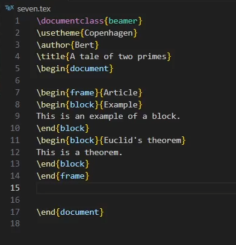
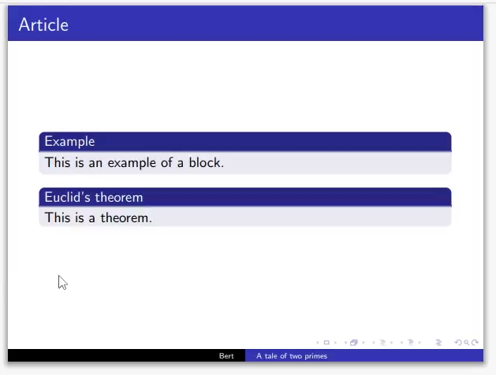
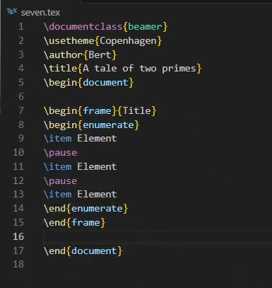
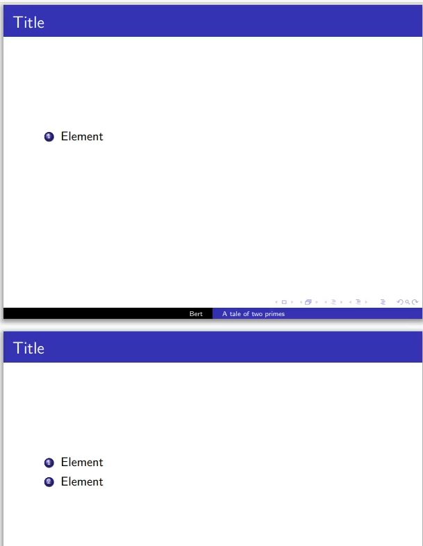
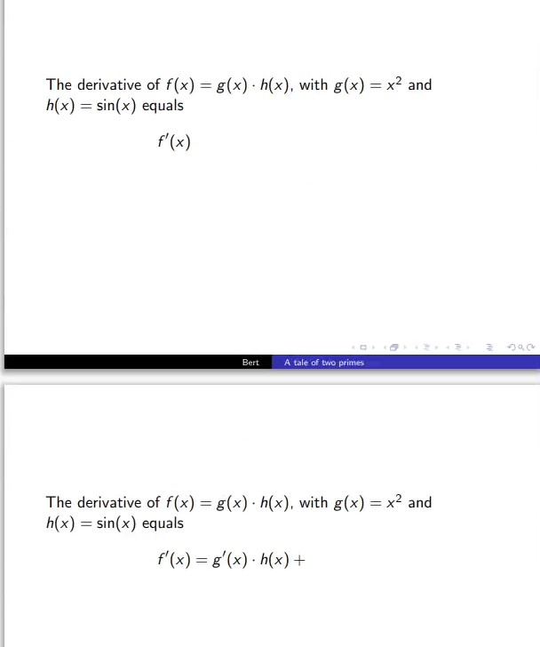
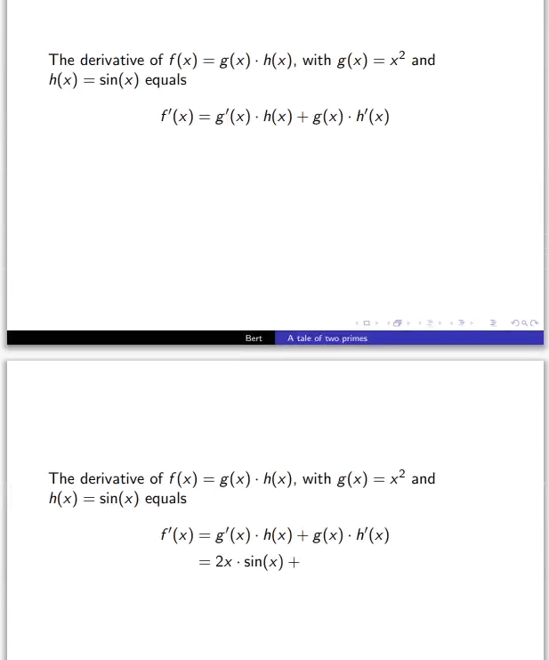
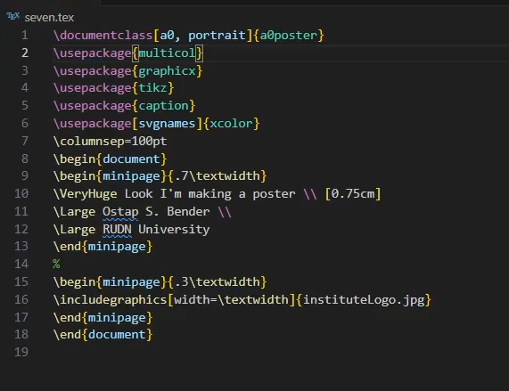
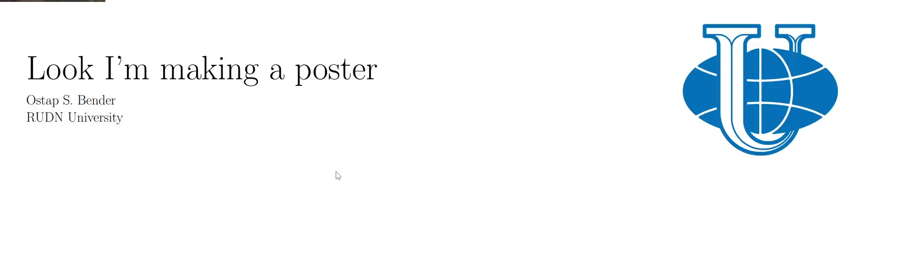
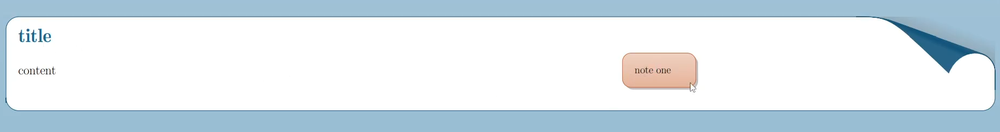
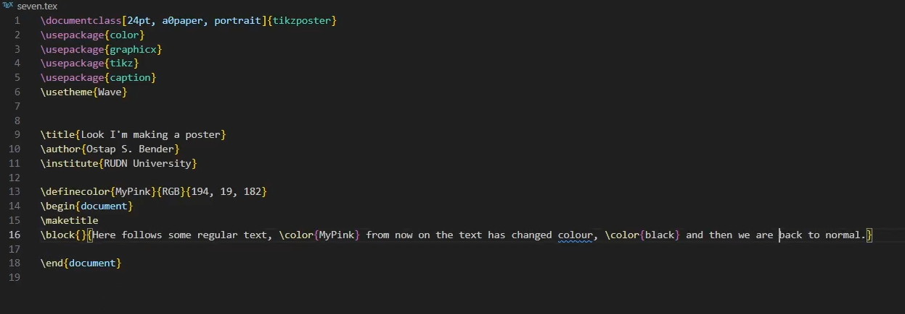

---
## Author
author:
  name: Данилова Анастасия Сергеевна
  email: 1132249523@pfur.ru
  affiliation:
    - name: Российский университет дружбы народов им. П. Лумумбы
      country: Российская Федерация
      city: Москва
      address: ул. Миклухо-Маклая, д. 6
## Title
title: Лабораторная работа №7
license: CC BY
date: today
date-format: "YYYY-MM-DD"
---

# Докладчик

- Данилова Анастасия Сергеевна  
- студент группы НФИмд-01-24  
- Российский университет дружбы народов им. П. Лумумбы  
- <1132249523@pfur.ru>

# LaTeX presentations

## Актуальность

LaTeX является отраслевым стандартом для научных публикаций благодаря высокому качеству вёрстки даже сложных формул. Он обеспечивает точность, автоматизацию нумерации и перекрёстных ссылок, что важно для исследований. Владение LaTeX — необходимое условие эффективной работы специалиста.

## Цели и задачи

Освоить создание презентаций в LaTeX несколькими способами, научиться использовать различные варианты оформления слайдов и текста.

## Материалы и методы
  
- **Сборка:** Quarto  
- **LaTeX:** TeX Live 2025, XeLaTeX  
- **Пакет LaTeX:** color, graphicx, tikz, caption, multicol, beamerposter, xcolor
- **Редактор:** VS Code.

## Начало работы

В LaTeX можно создать презентацию, используя класс beamer. У нас получится пустая основа без слайдов. Поэтому давайте сразу добавим пару простых слайдов.

{#fig-001 width=70% fig-cap="Код для простого примера"}

## Простые примеры (результат)

Мы можем видеть самые простые слайды

{#fig-002 width=70% fig-cap="1 слайд"}

## Простые примеры (результат)

{#fig-003 width=70% fig-cap="2 слайд"}

## Разделяем на блоки

{#fig-004 width=70% fig-cap="Код с block"}

## Разделяем на блоки

{#fig-005 width=50% fig-cap="Блоки"}

## Постепенный вывод

Посмотрим, как можно сделать поэтапный вывод элементов на слайде

{#fig-008 width=30% fig-cap="код"}

## Постепенный вывод

{#fig-009 width=30% fig-cap="Постепенное отображение"}

## Постепенный вывод

{#fig-010 width=30% fig-cap="Постепенное отображение"}

## Постепенный вывод с uncover

А теперь рассмотрим похожий вариант с командой uncover, которая является более гибкой и универсальной

{#fig-016 width=40% fig-cap="uncover"}

## Постепенный вывод с uncover

{#fig-017 width=30% fig-cap="uncover вывод"}

## Постепенный вывод с uncover

{#fig-018 width=30% fig-cap="uncover вывод 2"}

## Poster (a0poster)

{#fig-024 width=30% fig-cap="a0poster"}

## Poster (a0poster)

{#fig-025 width=30% fig-cap="a0poster"}

## Разделение на колонки (beamerposter)

{#fig-030 width=70% fig-cap="beamerposter"}

## Разделение на колонки (beamerposter)

{#fig-031 width=70% fig-cap="beamerposter"}

## Заметки

{#fig-034 width=70% fig-cap="note"}

## Заметки

{#fig-035 width=70% fig-cap="note"}

## Изменение цвета (tikzposter)

{#fig-038 width=70% fig-cap="tikzposter"}

## Изменение цвета (tikzposter)

Обратим внимание не только на текст, но также и на изменение темы

{#fig-039 width=70% fig-cap="tikzposter}

## Выводы

В ходе данной работы мы разобрались, как создавать презентации в LaTeX несколькими способами, научились использовать различные варианты оформления слайдов и текста.
