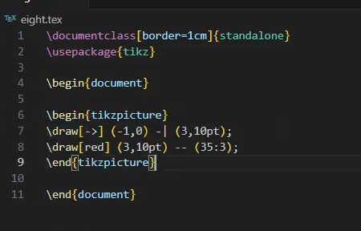
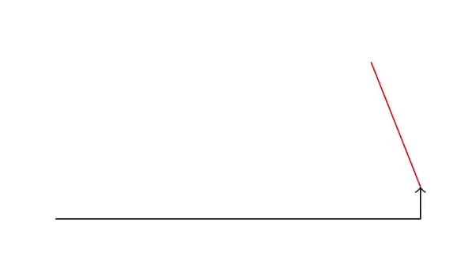
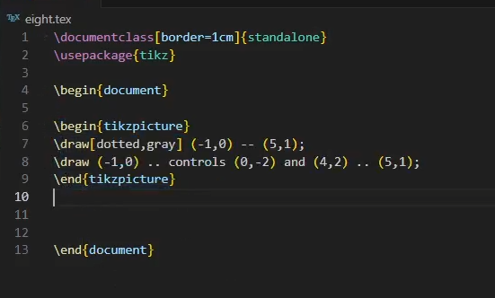
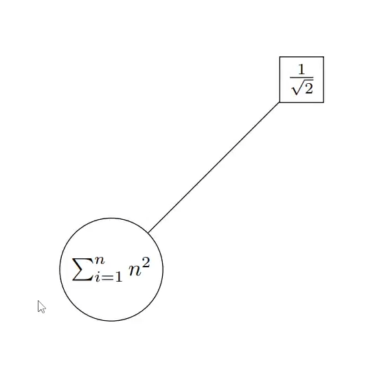
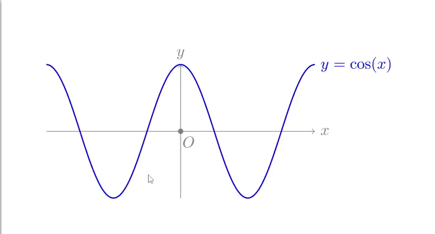
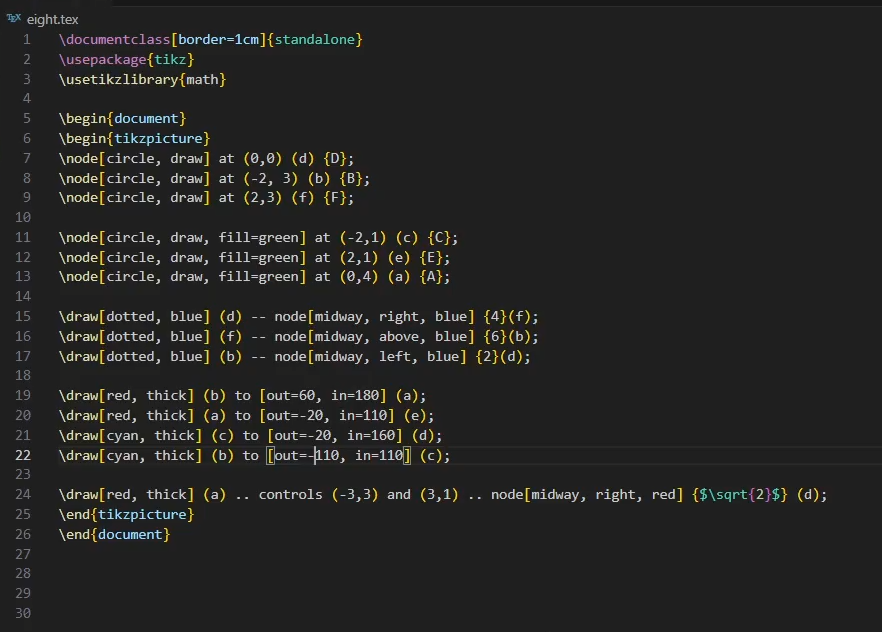
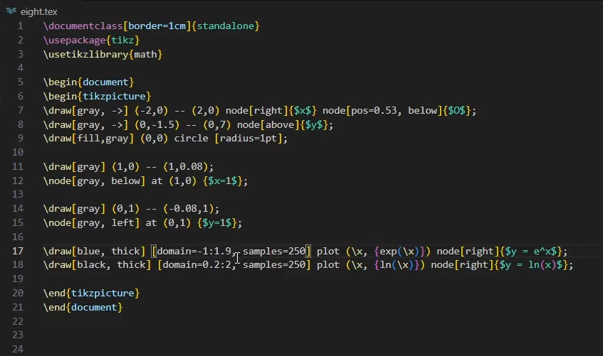
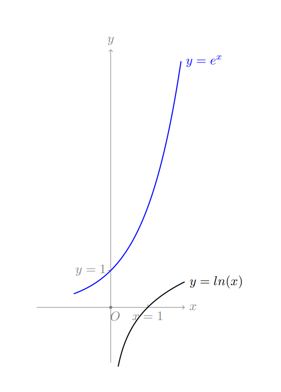

---
## Author
author:
  name: Данилова Анастасия Сергеевна
  email: 1132249523@pfur.ru
  affiliation:
    - name: Российский университет дружбы народов им. П. Лумумбы
      country: Российская Федерация
      city: Москва
      address: ул. Миклухо-Маклая, д. 6
## Title
title: Лабораторная работа №8
license: CC BY
date: today
date-format: "YYYY-MM-DD"
---

# Докладчик

- Данилова Анастасия Сергеевна  
- студент группы НФИмд-01-24  
- Российский университет дружбы народов им. П. Лумумбы  
- <1132249523@pfur.ru>

# Diagrams and drawings as code

## Актуальность

LaTeX является отраслевым стандартом для научных публикаций благодаря высокому качеству вёрстки даже сложных формул. Он обеспечивает точность, автоматизацию нумерации и перекрёстных ссылок, что важно для исследований. Владение LaTeX — необходимое условие эффективной работы специалиста.

## Цели и задачи

Освоить базовые средства пакета TikZ для построения графических объектов в LaTeX: рисование отрезков и кривых по координатам (декартовым и полярным), создание и оформление узлов (nodes), добавление подписей к рёбрам, построение графиков функций с помощью plot, а также применение циклов и рекурсии.

## Материалы и методы
  
- **Сборка:** Quarto  
- **LaTeX:** TeX Live 2025, XeLaTeX  
- **Пакет LaTeX:** tikzpicture 
- **Редактор:** VS Code.

## Начало работы

Существует множество различных наборов инструментов для создания графических объектов в документе TeX. Самый известный и, вероятно, наиболее широко используемый из этих наборов инструментов. Из названия набора инструментов видно, что создание фигуры в TikZ не будет работать путем рисования фигуры, как это обычно делается в Paint или подобных программах для рисования. Для создания фигуры с помощью TikZ вам потребуется запрограммировать ее, используя специальные команды TeX. Здесь мы рассмотрим основы TikZ.

## Простые примеры
Мы можем пробовать создавать множество вариантов линий, экспериментируя с их цветами, и видами.
{#fig-003 width=60%}

## Простые примеры

{#fig-004 width=70%}

## Простые примеры

Теперь изогнем линию, добавив две support points.

{#fig-007 width=70%}

## Простые примеры

{#fig-008 width=70%}

## Узлы

Иногда нам нужно вставлять какие-то подписи или текст. Мы можем сделать это с помощью узлов.

{#fig-017 width=70%}

## Узлы

{#fig-018 width=70%}

## Функции

Теперь добавим систему координат, сделаем все подписи и изменим цвет косинусоиды.

{#fig-023 width=70%}

## Функции

{#fig-024 width=70%}

## Задания для самостоятельного решения

Нам нужно повторить предложенные графики. Точность может быть неидеальная, но общий вид должен быть схож. В целом, мы используем все то, что изучили выше, а именно: узлы, линии.

{#fig-029 width=70%}

## Задания для самостоятельного решения

{#fig-030 width=70%}

## Задания для самостоятельного решения

Во втором задании у нас две функции и система координат. Это также было в примерах, но в упрощенном варианте.

{#fig-031 width=70%}

## Задания для самостоятельного решения

{#fig-032 width=70%}

## Выводы

В ходе данной работы мы освоили базовые средства пакета TikZ для построения графических объектов в LaTeX: научились рисовать отрезки и кривые по декартовым и полярным координатам, создавать и оформлять узлы (nodes), добавлять подписи к рёбрам и соединять элементы по именам узлов. Мы построили графики функций с помощью plot и настроили оси и отметки на графиках, а также применили циклы и рекурсию. 
