---
## Author
author:
  name: Данилова Анастасия Сергеевна
  email: 1132249523@pfur.ru
  affiliation:
    - name: Российский университет дружбы народов
      country: Российская Федерация
      postal-code: 117198
      city: Москва
      address: ул. Миклухо-Маклая, д. 6

## Title
title: "Лабораторная работа №8"
subtitle: "Diagrams and drawings as code"
license: "CC BY"
---

# Цель работы

Освоить базовые средства пакета TikZ для построения графических объектов в LaTeX: рисование отрезков и кривых по координатам (декартовым и полярным), создание и оформление узлов (nodes), добавление подписей к рёбрам, построение графиков функций с помощью plot, а также применение циклов и рекурсии.

# Задание

Повторить приведенные примеры, а также выполнить упражнения:

1. Откройте свой любимый редактор TeX и попробуйте настроить график ниже: График не обязательно должен выглядеть точно так же, чтобы совпадать с изображением, главное, чтобы вы смогли настроить график с похожими свойствами.
2. Попробуйте отформатировать график, следуя этому упражнению. 
3. Скопируйте приведенный выше код для треугольников Серпинского и попробуйте адаптировать его так, чтобы вы могли сгенерировать фигуру, отображающую несколько итераций ковра Серпинского

# Теоретическое введение

Существует множество различных наборов инструментов для создания графических объектов в документе TeX. Самый известный и, вероятно, наиболее широко используемый из этих наборов инструментов. Из названия набора инструментов видно, что создание фигуры в TikZ не будет работать путем рисования фигуры, как это обычно делается в Paint или подобных программах для рисования. Для создания фигуры с помощью TikZ вам потребуется запрограммировать ее, используя специальные команды TeX. Здесь мы рассмотрим основы TikZ.

Подробнее можно изучить в [@kotelnikov_chebotaev_book_latex2_ru; @lvovsky_book_latex_ru].

# Выполнение лабораторной работы

Начнем с ломаной линии. Указываем координаты и угол, под которым продолжится эта линия.

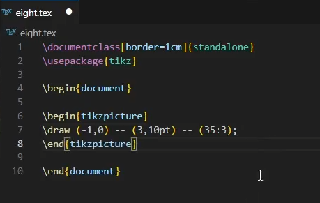{#fig-001 width=70%}

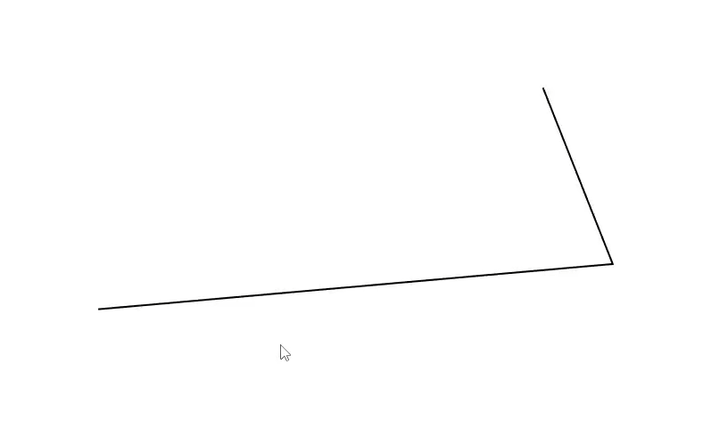{#fig-002 width=70%}

Мы можем пробовать создавать множество вариантов линий, экспериментируя с их цветами, и видами. Например, нарисуем стрелку и изменим частично цвет.
([рис. @fig-004]).

{#fig-003 width=70%}

{#fig-004 width=70%}

Мы можем рисовать не только прямые линии, но и изогнутые. ([рис. @fig-006]).

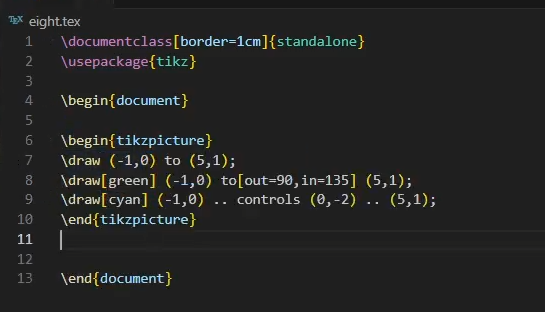{#fig-005 width=70%}

Голубая и зеленые линии созданы разными способами.

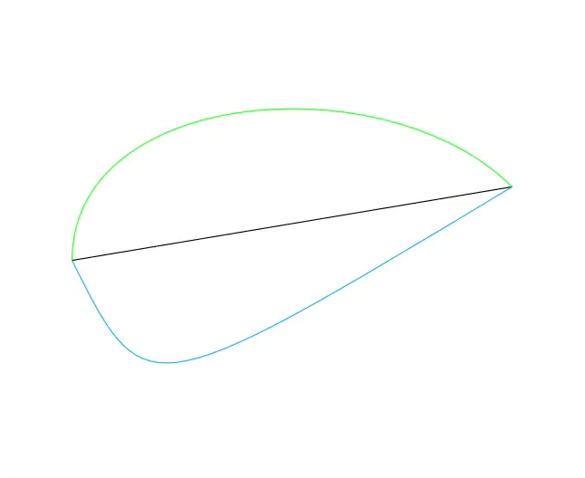{#fig-006 width=70%}

Теперь изогнем линию еще больше, добавив две support points.

{#fig-007 width=70%}

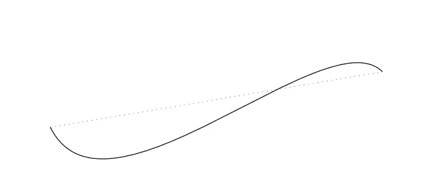{#fig-008 width=70%}

Иногда нам нужно вставлять какие-то подписи или текст. Мы можем сделать это с помощью узлов.

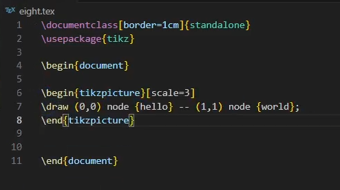{#fig-009 width=70%}

Теперь у нас появились подписи с двух сторон отрезка.

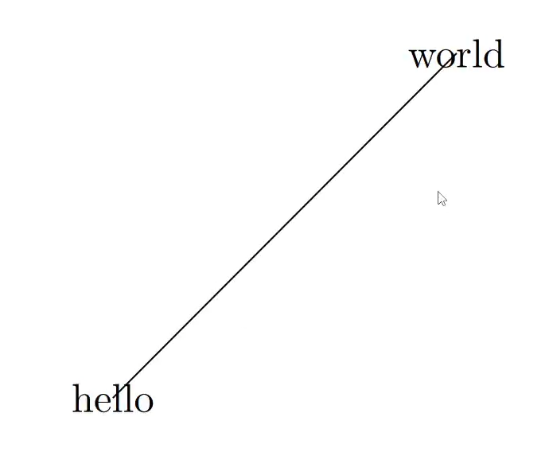{#fig-010 width=70%}

Узлы позволяют располагать текст, как около линии, так и внутри самих узлов. Нужно лишь задать параметры.

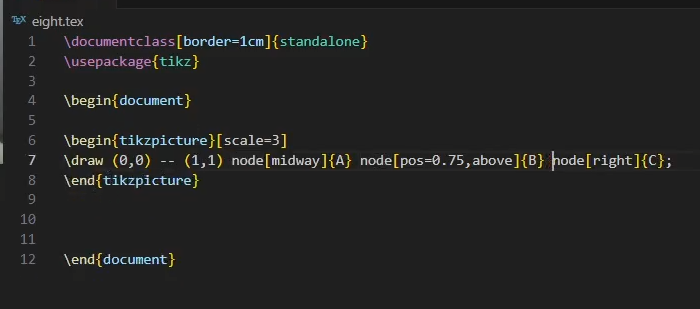{#fig-011 width=70%}

Мы видим, как наши подписи появились на разных частях отрезка.

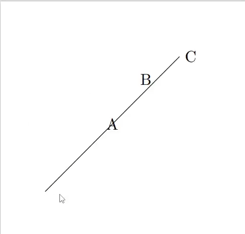{#fig-012 width=70%}

Вместо -- для создания линий, как мы делали ранее, можно использовать to.

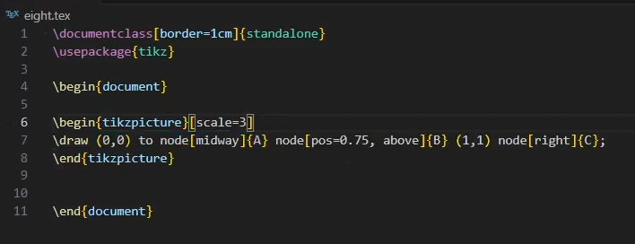{#fig-013 width=70%}

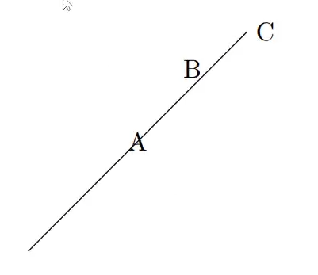{#fig-014 width=70%}

Сами узлы могут принимать разные формы, а также внутри них мы можем вписывать формулы.

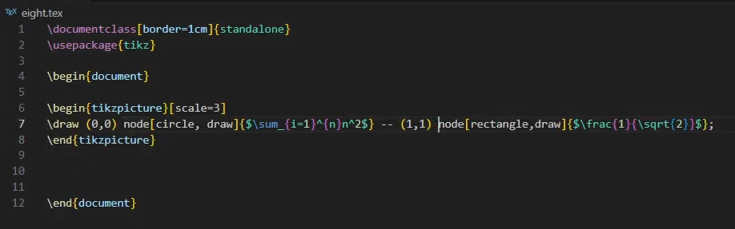{#fig-015 width=70%}

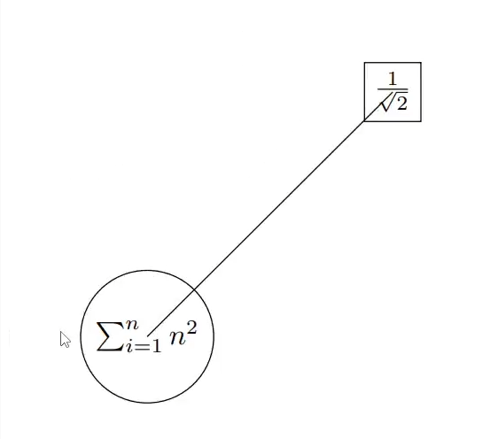{#fig-016 width=70%}

Соединение можно сделать аккуратнее. Пропишем каждый узел отдельно и дадим им названия. Затем соединим

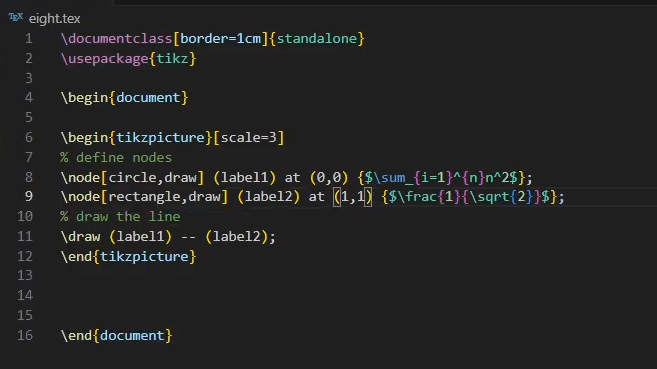{#fig-017 width=70%}

{#fig-018 width=70%}

Используя полученную информацию выше, сделаем более сложный объект.
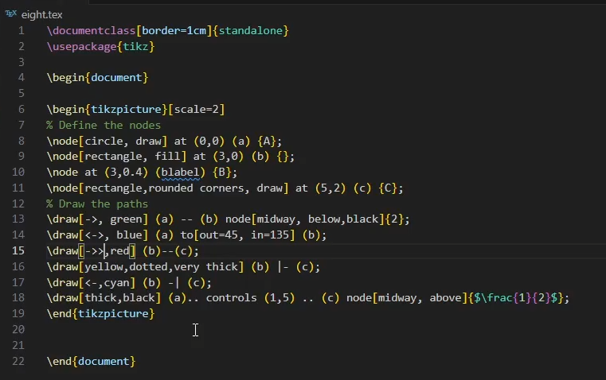{#fig-019 width=70%}

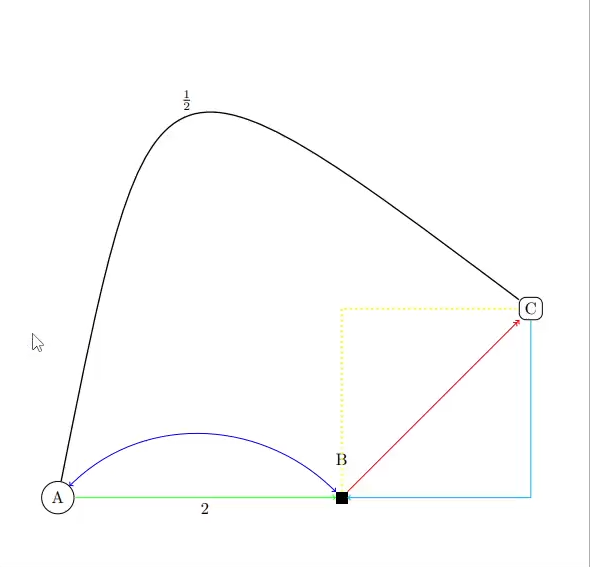{#fig-020 width=70%}

Также часто могут понадобиться какие-то функции. Рассмотрим самую простую:

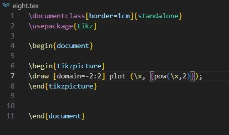{#fig-021 width=70%}

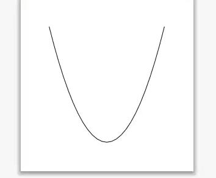{#fig-022 width=70%}

Теперь добавим систему координат, сделаем все подписи и изменим цвет косинусоиды.

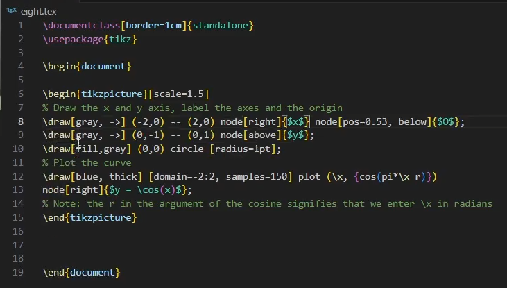{#fig-023 width=70%}

{#fig-024 width=70%}

Можем использовать foreach для создания петель. Мы перебираем значения x и диаметр меняется.

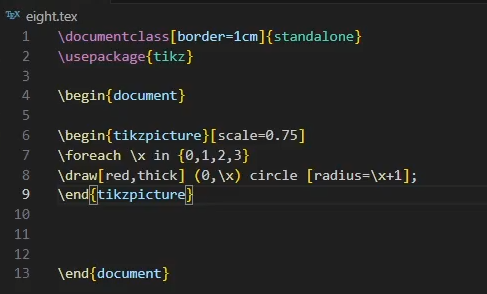{#fig-025 width=70%}

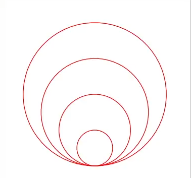{#fig-026 width=70%}

Теперь мы можем реализовать Треугольник Серпинского, сделав первые 6 итераций.
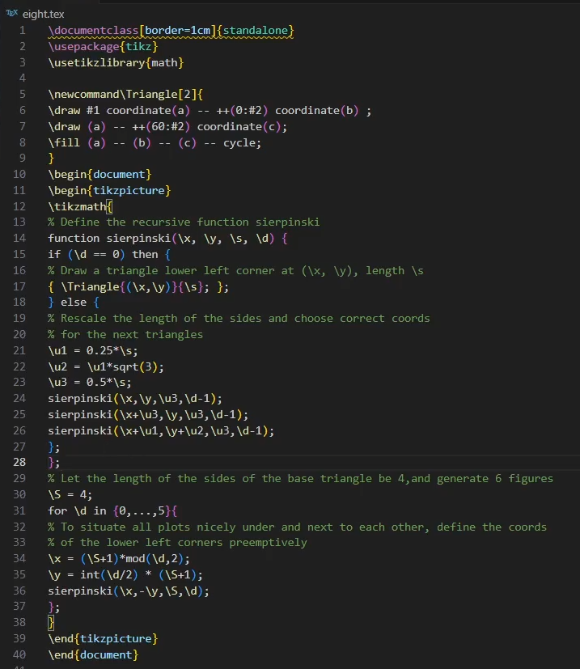{#fig-027 width=70%}

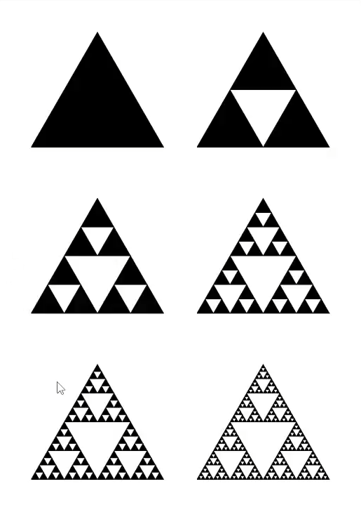{#fig-028 width=70%}

**Перейдем к заданиям для самостоятельного решения:**

Нам нужно повторить предложенные графики. Точность может быть неидеальная, но общий вид должен быть схож. В целом, мы используем все то, что изучили выше, а именно: узлы, линии, которые их соединяют. Линии у нас в двух разных цветах, с подписями. А также узлы зеленых цветов.

{#fig-029 width=70%}

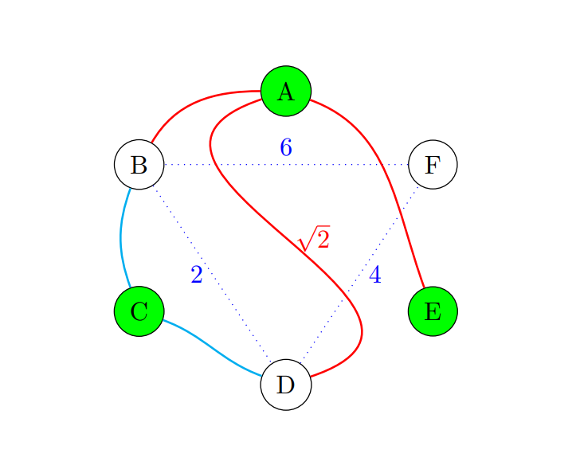{#fig-030 width=70%}

Во втором задании у нас две функции и система координат. Это также было в примерах, но в упрощенном варианте.

{#fig-031 width=70%}

{#fig-032 width=70%}

# Выводы

В ходе данной работы мы освоили базовые средства пакета TikZ для построения графических объектов в LaTeX: научились рисовать отрезки и кривые по декартовым и полярным координатам, создавать и оформлять узлы (nodes), добавлять подписи к рёбрам и соединять элементы по именам узлов. Мы построили графики функций с помощью plot и настроили оси и отметки на графиках, а также применили циклы и рекурсию. 

# Список литературы{.unnumbered}

::: {#refs}
:::
